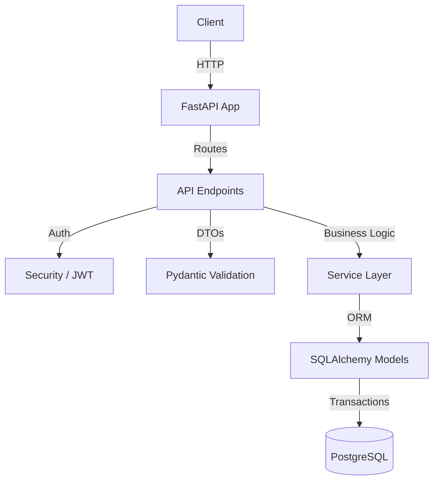

# EVE Healthcare — Backend Assessment

A backend service for diagnostic test bookings and simulated payments, focusing on data integrity, idempotent webhook processing, and correct state management.

## 1. Project Overview
This project provides a robust REST API for an online diagnostic test booking platform. It handles user authentication, viewing available diagnostic tests and centres, booking tests, and processing payments. Crucially, it demonstrates how to handle unreliable third-party payment webhooks safely using a two-layer idempotency strategy.

## 2. Why This Architecture
The application uses a 4-layer architecture: **Routes → Services → Database Models**.
- **No unnecessary abstractions**: With SQLAlchemy 2.x, inline queries in the service layer provide clear, type-safe data access without the overhead of the Repository pattern.
- **Service Layer**: Business logic (like state transitions and double-payment checks) is strictly isolated in the service layer, keeping API routes thin.
- **Data Integrity**: Enforced through PostgreSQL features like `UNIQUE` constraints, `NUMERIC` types, and row-level locking (`SELECT FOR UPDATE`).

## 3. Tech Stack
- **Web Framework**: FastAPI (Python 3.12)
- **Database**: PostgreSQL 16
- **ORM**: SQLAlchemy 2.0
- **Migrations**: Alembic
- **Validation**: Pydantic v2
- **Auth**: JWT (python-jose), bcrypt
- **Testing**: pytest, httpx

## 4. Architecture Overview



## 5. Database Schema Explanation
- **`users`**: Stores user credentials. `email` has a `UNIQUE` index.
- **`diagnostic_centres`** & **`diagnostic_tests`**: Core resources. `price` uses `NUMERIC(10,2)` to prevent floating-point precision loss. `test.centre_id` enforces relationship integrity.
- **`bookings`**: Stores appointments. Uses an explicit `Enum` for status (`PENDING`, `CONFIRMED`, `FAILED`, `CANCELLED`).
- **`payments`**: Records simulated payment attempts. Has a `UNIQUE` constraint on `provider_reference`.
- **`webhook_events`**: An audit table for incoming provider webhooks. `provider_event_id` is `UNIQUE`.

## 6. Booking Lifecycle
1. User creates a booking → Status becomes `PENDING`.
2. Explicit state transitions are enforced:
   - User pays successfully → `CONFIRMED`
   - User's payment fails → `FAILED`
   - User cancels → `CANCELLED`
3. `CONFIRMED`, `FAILED`, and `CANCELLED` are terminal states. They cannot be overwritten.

## 7. Payment Lifecycle
1. User initiates a payment for a `PENDING` booking.
2. The service looks up the correct `amount` (clients cannot tamper with the price).
3. The mock payment outcome is determined (controlled by the `simulate` field in the request for easy testing).
4. A `Payment` record is created, and the `Booking` status is updated in the **same transaction**.

## 8. Webhook Idempotency Strategy
Idempotency ensures that duplicate or overlapping webhook deliveries from a payment provider do not create duplicate payments or corrupt the booking state.

This project implements a **two-layer defense**:

- **Layer 1: Event Deduplication (INSERT-first strategy)**
  When a webhook arrives with `event_id`, the system immediately attempts to `INSERT` it into `webhook_events`. The `provider_event_id` column has a `UNIQUE` constraint.
  Using a database `SAVEPOINT` (`begin_nested()`), if a duplicate arrives concurrently, the database enforces the uniqueness constraint and raises an `IntegrityError`. The duplicate request safely catches this, rolls back the inner savepoint, and returns HTTP 200 without side effects.
  *Why this is good: It avoids the classic check-then-insert race condition where two concurrent requests might both pass the check.*

- **Layer 2: Payment Deduplication & State Locking**
  Different events might reference the same payment attempt (e.g., a provider retry). We enforce `UNIQUE(provider_reference)` on the `payments` table.
  Before transitioning the booking state, we lock the booking row using `SELECT ... FOR UPDATE`. This prevents a race condition where a `SUCCESS` event and a `FAILED` event for the same booking arrive simultaneously. Finally, we check if the booking is already in a terminal state to prevent backward transitions.

## 9. API Endpoint Table

| Method | Endpoint | Description | Auth Required |
|---|---|---|---|
| POST | `/auth/signup` | Register new user | No |
| POST | `/auth/login` | Login and receive JWT | No |
| GET | `/centres/` | List all diagnostic centres | No |
| GET | `/centres/{id}/tests` | List tests offered by a centre | No |
| POST | `/bookings/` | Create a test appointment | Yes |
| GET | `/bookings/` | List user's bookings | Yes |
| POST | `/bookings/{id}/cancel`| Cancel a pending booking | Yes |
| POST | `/payments/` | Process a mock payment | Yes |
| POST | `/payments/webhook/` | Idempotent webhook receiver | No |

## 10. Local Setup
Ensure you have Python 3.12+ and PostgreSQL installed.

1. Clone the repository.
2. Create a virtual environment: `python -m venv .venv`
3. Activate it: `.venv\Scripts\activate` (Windows) or `source .venv/bin/activate` (Mac/Linux)
4. Install dependencies: `pip install -r requirements.txt`
5. Copy `.env.example` to `.env` and configure `DATABASE_URL`.

## 11. Docker Setup
To run everything via Docker Compose:
```bash
docker compose up --build
```
This automatically starts PostgreSQL, applies Alembic migrations, seeds the database with initial diagnostic centres and tests, and starts the FastAPI server on port 8000.

## 12. Environment Variables
See `.env.example`:
- `DATABASE_URL`: PostgreSQL connection string.
- `SECRET_KEY`: Used to sign JWTs.
- `ACCESS_TOKEN_EXPIRE_MINUTES`: JWT expiry.

## 13. Running Migrations
```bash
alembic upgrade head
```

## 14. Running Tests
Tests use a separate PostgreSQL database defined by `TEST_DATABASE_URL` to ensure isolation and accurate testing of transactions/constraints.
```bash
pytest -v
```

## 15. Example API Flows

**Booking a test and paying for it:**
1. `POST /auth/signup` to create an account.
2. `POST /auth/login` to get a Bearer token.
3. `GET /centres/` to find a diagnostic centre ID.
4. `GET /centres/{id}/tests` to find a test ID.
5. `POST /bookings/` (with Bearer token) sending `test_id`, `centre_id`, and `appointment_at`. Returns a `PENDING` booking.
6. `POST /payments/` (with Bearer token) sending `"booking_id": "uuid", "simulate": "SUCCESS"`. Returns a successful payment.
7. `GET /bookings/{id}` confirms the booking status is now `CONFIRMED`.

## 16. Important Assumptions
- The payment simulation provides a `simulate` flag (`SUCCESS` or `FAILED`) explicitly to allow deterministic testing of both flows. In production, this would route to a real provider SDK.
- The webhook endpoint `/payments/webhook/` is intentionally public. In a real-world scenario, it would validate a cryptographic signature provided by the external payment gateway (e.g., Stripe-Signature).

## 17. Edge Cases Handled
- **Concurrent identical webhooks**: Database `UNIQUE` constraint on event ID catches the race condition.
- **Concurrent conflicting webhooks (Success vs. Failed)**: Handled via `SELECT FOR UPDATE` on the booking row.
- **Late webhooks**: If a booking is already `CONFIRMED`, a late `FAILED` webhook is ignored safely.
- **Double payment**: If a booking already has a successful payment, further payment attempts return `409 Conflict`.
- **Client-side price tampering**: The `/bookings/` endpoint derives the amount from the database `price`, ignoring any amount the client might try to send.

## 18. What I Would Improve With More Time
- **Pagination enhancements**: Cursor-based pagination for large datasets instead of offset/limit.
- **Background tasks**: For a production system, webhooks could be pushed to a queue (like RabbitMQ or Redis/Celery) for asynchronous processing, allowing the webhook HTTP handler to return immediately.
- **Soft Deletes**: Implementing soft deletion for users and bookings to preserve historical audit data.
- **Caching**: Redis caching for frequently accessed data like the list of diagnostic centres and tests.
